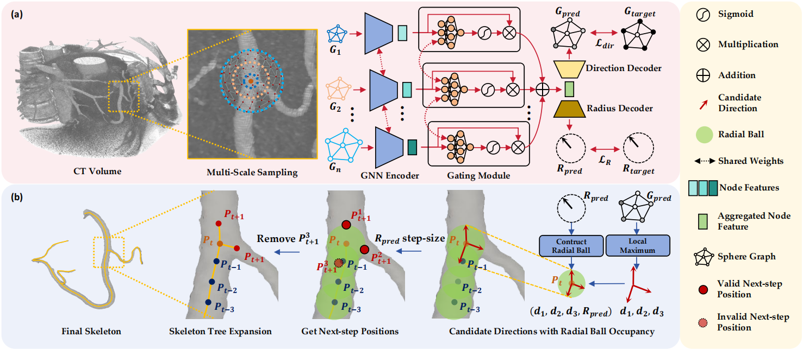

## TopoVST: Towards Topology-fidelitous Vessel Skeleton Tracking

This work is the code base for paper TopoVST: Towards Topology-fidelitous Vessel Skeleton Tracking(Under Review).

> By Yaoyu Liu, Minghui Zhang, Junjun He, Yun Gu
> > Institute of Medical Robotics, Shanghai Jiao Tong University, Shanghai, China.
>
> > Shanghai AI Lab, Shanghai, China.

A brief overview of our work. We utilize multi-scale GNNs for vessel skeleton direction and radius estimation.


### Training and testing
Before training TopoVST, you need to generate training samples. Run:
```bash
python src/scripts/generate_samples.py
```
or use the `run_scripts.sh` provided. NOTE that you need to specify path to your own dataset.

Run:
```bash
python src/scripts/tr_ts_wrapup_topovst.py --device YOUR_DEVICE --use_steps CKPT_STEPS
```
to first train then test TopoVST on the dataset.
